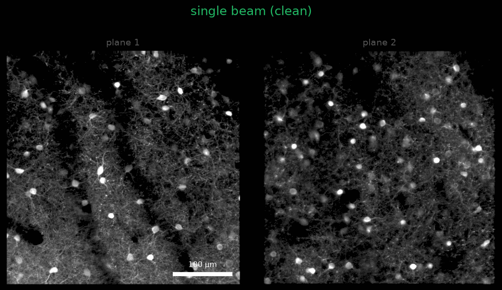
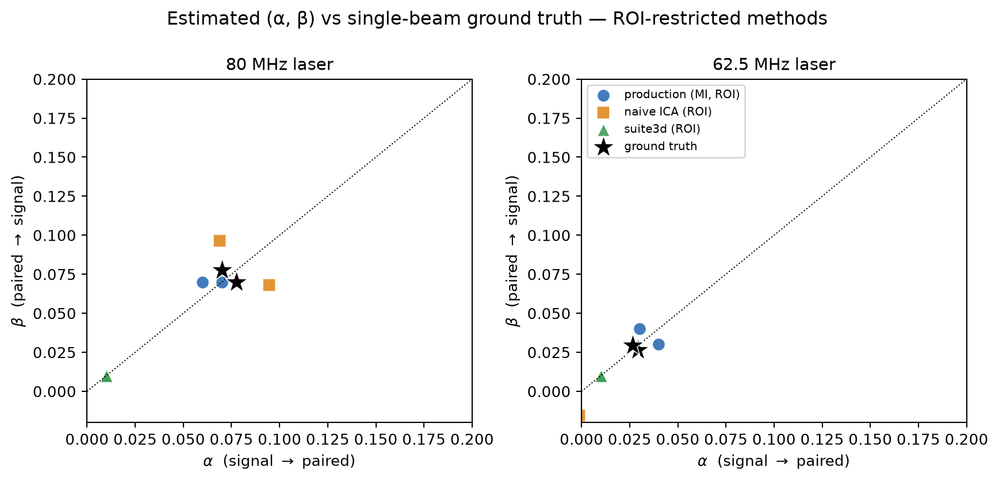
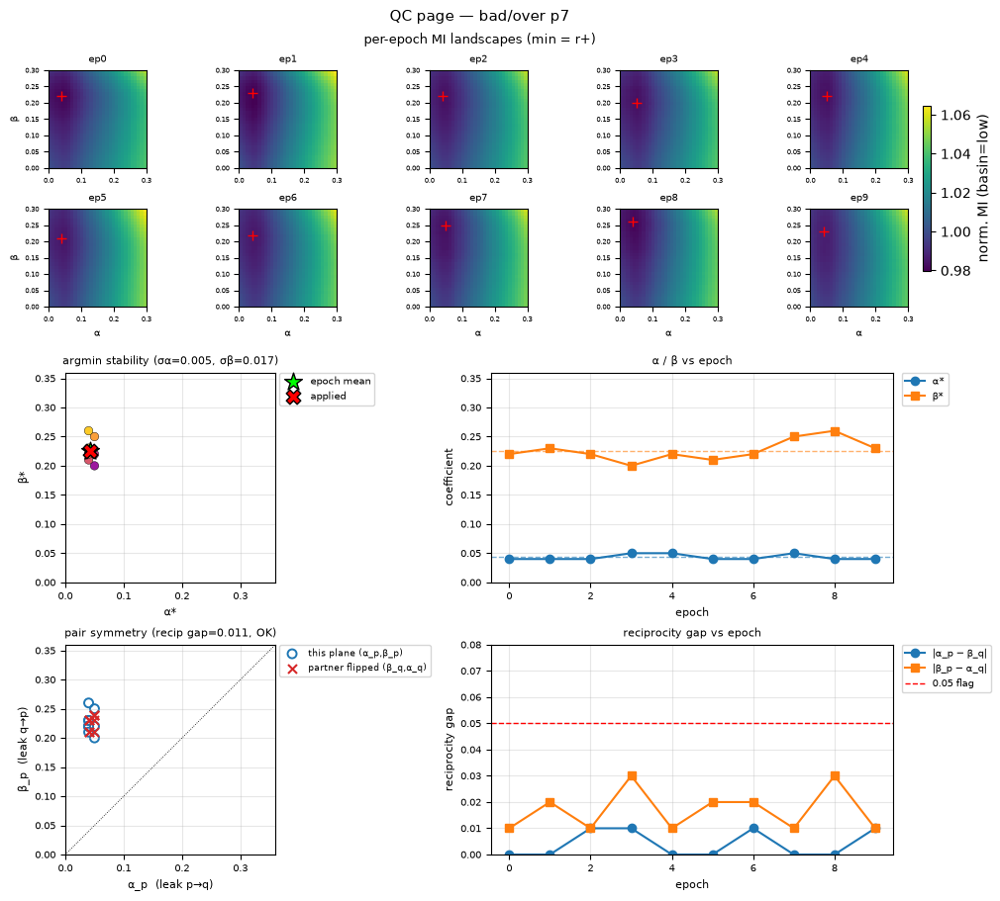

**Contributors**

- **Natalia Orlova** — Microscope setup; initial decrosstalk algorithm (trace-based unmixing).
- **Sam Seid** — Ground-truth data collection.
- **Arielle Leon & Sean McCulloch** — Integration of the algorithm into the pipeline.
- **Johannes Friedrich** — Discussion of the algorithm; suite3d implementation and testing.
- **Jerome Lecoq** — Discussion of the algorithm.

Two-photon mesoscopes let us record from a lot of neurons at once, in the Allen Brain
Observatory and many other projects across the Institute. One trick for recording even more
neurons is to split the laser and image **two depths at the same time**. It comes with a subtle
problem: the two planes bleed into each other.

A faint copy of one plane shows up as "ghost" cells in the other. Left uncorrected, those
ghosts look like real neurons. Just as important, the bleed-through **contaminates the activity
traces (ΔF/F) extracted from genuine ROIs**, degrading real cells — not only adding spurious
ones.

This post walks through the problem and the correction we run in production: what the
crosstalk is and where it comes from, why the obvious fixes don't work, how our
estimator works, and how well it does — measured against real ground-truth recordings,
against simulations, and against two off-the-shelf alternatives (naive ICA and suite3d).
I'll also cover the quality-control tooling we built to catch the rare failures.

---

## 1. What is paired-plane crosstalk? {#s1}

To image more neurons per session, a two-photon mesoscope can be upgraded to capture **two
depths at once**. The excitation laser is **split into two beams**, one is given a small time
delay, and the two are focused at **two different depths**. We refer to this beam-splitting
configuration internally as the **multiscope** [@tsyboulski2018].

The multiscope is one of a broader family of temporally-multiplexed two-photon systems —
spatiotemporal multiplexing [@cheng2011], reverberation microscopy [@beaulieu2020], and light-beads microscopy [@demas2021] —
that excite multiple planes and separate them by photon arrival time, and all face the same
crosstalk (cf. the Diesel2p mesoscope [@yu2021], which uses a separate resonance scanner per beam and
so has no comparably structured crosstalk).

Both depths are excited within a single inter-pulse interval (~16 ns at a 62.5 MHz repetition
rate), and the fluorescence from each is separated by a **time-gated collection window** — one
gate per plane.

The catch is fluorescence lifetime. A GCaMP molecule keeps emitting for a few nanoseconds
after it is excited (the fluorescence lifetime of GFP-based indicators is **≈2.6 ns** [@simonyan2024]),
so the **tail** of one plane's fluorescence spills into the *other* plane's collection
gate. Those stray photons get counted as the wrong plane's signal. That is the crosstalk
([Figure 1](#figure-1)).

{#figure-1}

Because it is optical/temporal, the amount of crosstalk is a property of the acquisition,
not of any particular neuron. In a well-tuned and balanced session it is only a few percent — invisible at native contrast, but enough to plant visible ghosts. The clean way to *see* it is a
**single-beam recording**: image a plane with its own beam only ("clean"), then with both
beams on ("crosstalk"). The extra ghost cells that appear in the dual-beam image are the
bleed-through ([Figure 2](#figure-2)).

{#figure-2}

---

## 2. Why the obvious fixes don't work {#s2}

If crosstalk is just "plane B leaking a fraction of its signal into plane A," why not
estimate that fraction directly — say, regress one plane's pixel time series against the
other's and subtract? Two confounds get in the way.

**The two planes share real biology.** They sit at the same location, a little apart in
depth, so they see much of the same **vasculature shadows and neuropil background**. That
makes the two images genuinely correlated *even with zero crosstalk*. Any method that
works by making the two planes independent — blind source separation (ICA [@hyvarinen2000]), or simply
minimizing their correlation — is misled by this shared anatomy: minimizing correlation never
bottoms out at the right amount and keeps **over-subtracting**, while ICA's assumption that the
planes are independent is false for genuinely correlated planes, so its coefficient comes out
**biased — by an amount, and even a direction, that changes with the data** ([§5](#s5)). 

**The two planes don't move together.** You might hope to line the planes up once and just
subtract — but a pair does not move as a rigid unit. Each plane is motion-corrected
independently, and when we compare the per-frame rigid shifts across **69 hour-long
sessions**, the two planes of a pair follow visibly *different* XY trajectories —
increasingly so the farther apart in depth they sit ([Figure 3](#figure-3)). 

{#figure-3}

You can see the consequence directly. Because the planes slide relative to each other, the
bleed-through is **not pinned to a fixed spot**: as you step through a session's epochs, the
ghost cells (a copy of the paired plane) visibly *drift* across the field of view while the
plane's own cells stay put ([Figure 4](#figure-4)).

{#figure-4}

Those facts — shared anatomy and a moving, differential offset between planes — are why the
correction is built the way it is: work on **motion-corrected episodic mean images** (instead of signal time series), restrict
attention to **bright ROIs** (to avoid vasculature), and 
minimize **mutual information** rather than plain correlation (to account for the shared structure).

---

## 3. The correction {#s3}

### The model

For a plane **A** imaged against its partner **B**, the observed images are a linear mix of
the true (crosstalk-free) images:

$$
\begin{bmatrix} \text{imaged}_A \\ \text{imaged}_B \end{bmatrix}
=
\begin{bmatrix} 1-\alpha & \beta \\ \alpha & 1-\beta \end{bmatrix}
\begin{bmatrix} \text{true}_A \\ \text{true}_B \end{bmatrix}
$$

so **α** is the fraction of A's own signal that leaks *out* into B, and **β** is the
fraction of B that leaks *in* and contaminates A. Undoing the crosstalk is just inverting
this 2×2 mixing matrix. The whole problem is estimating **(α, β)**.

Note this is a *relative* crosstalk between two planes of different brightness — so the
brightness imbalance between the planes matters, and α and β are generally not equal.

Also note that this shares a fundamental principle with ICA; how the two differ in practice is discussed below.

Lastly, applying the inverse mixing matrix not only removes crosstalk signal but also restores the plane's own signal that was subtracted out by the crosstalk. The correction is therefore a *reconstruction* of the plane's own signal, not just a subtraction of the paired plane's ghost ([Figure 7B](#figure-7)).

### Estimating (α, β)

1. **Work on registered mean images.** Each plane is motion-corrected, and the paired plane's raw movie
   is registered using the same correction ("registered-to-pair"). This solves the problem of differential motion in XY.
2. **Bright-ROI bounding boxes.** Rather than the full frame, the estimator works inside
   bounding boxes around the brightest ROIs of both planes ([Figure 6](#figure-6), left). This
   avoids the shared low-frequency background — the key to not over-subtracting shared anatomy.
3. **Grid search minimizing mutual information.** For each candidate (α, β) on a grid, the
   estimator unmixes the pair and computes the **mutual information (MI)**
   between the two reconstructed images, averaged over the ROI boxes. The chosen (α, β) is
   the one that **minimizes** MI — the point at which the two planes carry the least
   information about each other ([Figure 6](#figure-6), right). Using MI rather than correlation matters:
   correlation falls monotonically as you subtract more, which would reward ever-larger
   coefficients; MI has a genuine minimum at the right amount.
4. **Averaging for stability.** Coefficients are averaged across imaging **epochs** and
   across the two directions of a **pair** (the leak A→B estimated for plane A should equal
   the leak into B estimated for plane B — see [§6](#s6)), then stored per plane.

![**Figure 5.** The full protocol. Each plane of a pair (signal *p1*, paired *p2*) is motion-corrected; each plane's registration transform is then applied to *both* planes — its own **registered movie** and the partner **registered-to-pair** (the paired plane re-registered with that transform). In each frame the mixing coefficients are estimated by minimizing MI between the two planes; the two estimates (from *p1*'s and *p2*'s registration) are **averaged**, and the inverse mixing matrix is applied to yield the decrosstalked movie for each plane. FOVs at left: dual-beam mean images (old-laser ground truth).](figures/fig_protocol.png){#figure-5}

{#figure-6}

---

## 4. Does it work? {#s4}

### How the ground-truth data were collected

To know the true crosstalk we need a recording where one plane's contribution to the other is
*known*. We get that by **blocking one of the two beams**: with a beam blocked, its plane is
never excited, so whatever appears in that plane's detector channel is *pure crosstalk* leaking
from the open plane — a dim, scaled replica of the open plane's image, acquired *simultaneously*
and therefore perfectly co-registered and activity-matched. Regressing the blocked channel onto
the open one gives the leak fraction directly, with no estimation and no confound from shared
anatomy or motion. Blocking each beam in turn measures both directions of the 2×2 mixing matrix
([Figure 7](#figure-7)).

![**Figure 7. How the ground-truth mixing matrix is measured.** *(A)* Block one beam: the un-excited plane's channel then contains only crosstalk from the open plane — a scaled replica acquired *simultaneously*. Columns are the two detector channels (ch1 middle, ch2 right); each row blocks one beam, so the signal (open channel) and crosstalk (blocked channel) swap sides. The crosstalk's intensity range is ~14× smaller, and that ratio is the coefficient (crosstalk ≈ coefficient × signal). α = 0.070 (ch1 → ch2; top row, beam 2 blocked); β = 0.078 (ch2 → ch1; bottom row, beam 1 blocked). *(B)* Applying the inverse of the mixing matrix built from these ground-truth coefficients to the observed (both-beam) image removes the crosstalk. Observed (left), decrosstalked (middle), and their difference (right; red = crosstalk removed, blue = the plane's own signal restored by the unmixing). Scale bars 100 µm.](figures/figS_gt_matrix.png){#figure-7}

### Seeing the correction

On the ground-truth data we can walk a plane through all three states — imaged single-beam
("clean", the truth), both-beam ("observed", with crosstalk), and after correction
("decrosstalked") — for both planes at once ([Figure 8](#figure-8)). The correction nudges the observed
image back toward the clean one; on the high-SNR session mean the change is deliberately
subtle (only a few percent of the signal is crosstalk), which is exactly why quality control
is hard ([§6](#s6)).

{#figure-8}

The crosstalk is far more striking on a *real* session when you step through its epochs.
Because the two planes move differently ([§2](#s2)), the ghost is not static — it **drifts across
the field of view over the session**. In the raw episodic mean movie below (middle), watch the
soft ghost cells in the upper field move in lockstep with the paired plane (right); after
decrosstalk (left) they are largely gone while the plane's own cells stay put.

{#figure-9}

**It also works in dense GCaMP8 samples.** Everything above is sparse pan-inhibitory data. In *pan-neuronal* soma-targeting recordings (SNAP25-Cre;TITL2-RiboL1-GCaMP8s), far more cells are labeled. The dense paired plane casts a correspondingly dense ghost into its partner, and — because the planes move differently — that ghost drifts across epochs; the same estimator removes it ([Figure 10](#figure-10)).

{#figure-10}

The removed structure is exactly the paired plane's cells — the crosstalk — and nothing else.
But "looks clean" is not a measurement. For that we need ground truth.

---

## 5. How accurate is it? Ground truth, simulation, and a bake-off {#s5}

The single-beam ground-truth recordings give us the true leak fractions directly (regress
the blocked channel on the open channel within ROIs): **0.070 / 0.078** for the 80 MHz laser
and **0.029 / 0.027** for the 62.5 MHz laser. That lets us score any estimator by how close its
(α, β) come to the truth, and by how much signal↔paired dependence is *left* after
unmixing. We compared three estimators:

| estimator | idea |
|---|---|
| **production** | minimize normalized MI over bright-ROI boxes |
| **naive ICA** | `FastICA` blind source separation |
| **suite3d** | correlation-inflection estimator [@haydaroglu2025] ([code](https://github.com/alihaydaroglu/suite3d/)) |

For a fair comparison, all three estimators were run on the **exact same** bright-ROI boxes,
so the test isolates the estimator itself.

**On the real ground-truth data**, production essentially nails it. Its (α, β) sit right on
the ground-truth values ([Figure 11](#figure-11)), its mean coefficient error is **0.007**, and it drives
the residual signal↔paired correlation from the raw ceiling (**0.465**) down to **0.189** —
i.e. to the shared-anatomy floor (**0.186**). It removes essentially all the *removable*
crosstalk.

{#figure-11}

**On simulations** — impose a known (α, β) on the clean images (a full 2-D grid, not just the
α = β diagonal) and try to recover it — the same picture holds across the whole plane
([Figure 12](#figure-12)). Production's estimates land right on the true grid points; naive ICA is
systematically biased — over-estimating on the 80 MHz laser and under-estimating on the
low-crosstalk 62.5 MHz laser; and suite3d collapses to ≈0.01 regardless of the true value,
ignoring the signal almost entirely.

{#figure-12}

**Takeaway from the bake-off.** All three methods were fit on identical bright-ROI patches, so
the comparison isolates the estimator. The ranking is **production > naive ICA > suite3d**, and
production is the only method that reliably reaches the shared-anatomy floor. suite3d's
correlation-inflection point [@haydaroglu2025] was likely intended to separate genuine shared correlation from
crosstalk — i.e., to cope with the shared anatomy — but it consistently under-corrected. When tested on the real data at the full frame, it corrected somewhat but still under-corrected in most cases.

---

## 6. Quality control {#s6}

Across a large pan-inhibitory dataset, most planes are corrected well — but a few are not,
and the failures are easy to miss. We built two QC tools.

**An interactive visual-QC app** ([Figure 13](#figure-13)) lets a labeler flip PRE↔POST and toggle the
paired (crosstalk-source) view at matched contrast, scrub epochs, and label each plane
`good` / `under-corrected` / `over-corrected` / `unsure`. These human labels are the ground
truth the automatic metrics are validated against.

{#figure-13}

**Automatic QC checks** exploit two structural facts about a *correct* estimate ([Figure 14](#figure-14)):

- **The MI landscape is stable across epochs and has one well-located minimum.** If the
  per-epoch landscapes wander or the minimum is multi-modal, the estimate is untrustworthy.
  In practice the minimum barely moves (σ ≈ 0.005–0.02).
- **Reciprocity.** A physical leak between planes p and q is estimated *twice*:
  the leak p→q appears as α of plane p and as β of plane q. For a sound estimate these
  agree (α_p ≈ β_q); a large reciprocity gap flags a one-plane segmentation or registration
  breakdown that per-plane views miss. Median gap ≈ 0.01.

{#figure-14}

One important lesson from QC: **judge decrosstalk on individual epochs, not the session
mean.** Decrosstalk is a linear, per-frame operation, so the corrected session-mean is
exactly the average of the corrected epochs — and the high-SNR mean can *camouflage*
residual crosstalk that individual, lower-SNR epochs expose. A plane whose mean looks
perfectly clean can still show per-epoch artifacts.

---

## Summary

Paired-plane crosstalk in a beam-splitting mesoscope is an optical/temporal artifact — a
few-percent ghost of one depth plane bleeding into the other. Because the two planes share
real anatomy and don't move in lockstep, naive decorrelation over-subtracts. Estimating the
mixing coefficients by **minimizing mutual information inside bright ROIs** on registered
mean images sidesteps both confounds, and — validated against single-beam ground truth,
simulations, and two alternative estimators — removes essentially all removable crosstalk,
reaching the irreducible shared-anatomy floor and clearly beating naive ICA and suite3d. QC
tooling catches the rare failures.

---

## Resources

- Production algorithm: [`aind-ophys-decrosstalk-roi-images`](https://github.com/AllenNeuralDynamics/aind-ophys-decrosstalk-roi-images)
- Visual-QC app: [`multiscope-decrosstalk-qc-app`](https://github.com/jkim0731/multiscope-decrosstalk-qc-app)

---

## References

::: {#refs}
:::
